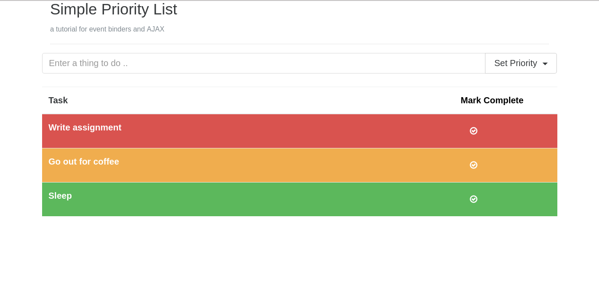

# JS-Tutorial-DJSCE
Basic Javascript demonstration/tutorial for college

### Make sure you have the following
- Xampp or WAMP or LAMP. Either of these stacks
- I'd recommend a good editor ... like sublime text

### Steps for setting up.

- Download the repository. You can click on `clone or download` button 
- IF using Xampp, or WAMP: place the folder `JS-Tutorial-DJSCE` into htdocs.
- Open phpmyadmin and create a database named as "djsce"
- Enter the selected database. Click on IMPORT (upper navigationbar)
- IMPORT djsce.sql file present in the root dir of the repository

- Next, open php_utils/conn.php
- set username and password according to your phpmyadmin settings.
- Eg. username = "root" ; password = ""; (if password is nothing).

### To view sample demo:
- goto `localhost/JS-Tutorial-DJSCE-master/demo/` in your browser

